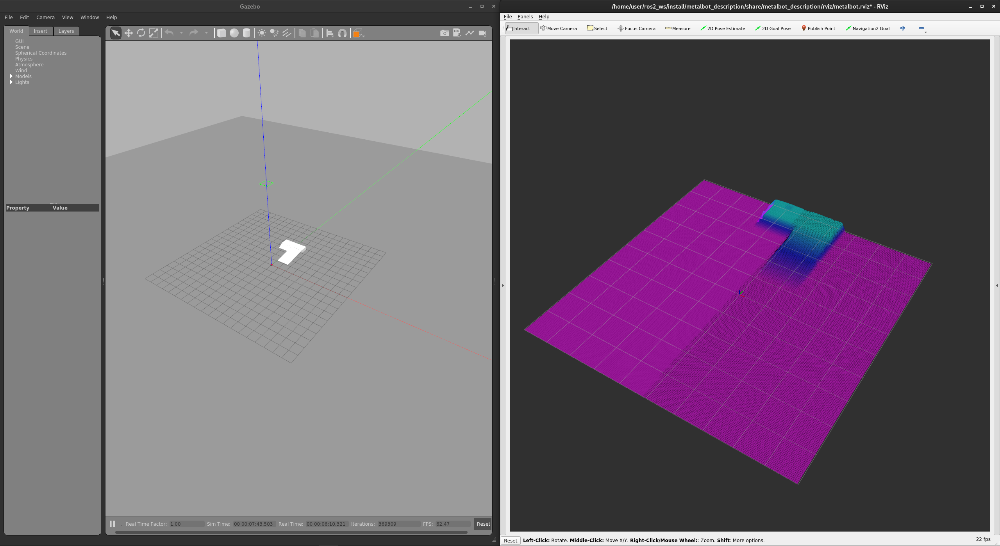

# Publisher of grid_map data

## Descrition

Package with simple grid_map publisher for 2.5D navigation debug. Node gets grid_map data from numpy array file and publishes some part of it to specified topic with constant frequency.



##  Dependencies

This package requires:

- `ROS2 Foxy` (including `TF2`)
- `grid_map` package ([GitHub Repository](https://github.com/ANYbotics/grid_map/tree/foxy-devel))
- `numpy`. 

## Input Data and Parameters

### Input Data

Numpy array file (`.npz`) should contain height map of the environment. Data should be placed at zero element of numpy array. Decription of grid_map data format available at [GitHub Repository](https://github.com/ANYbotics/grid_map/tree/foxy-devel).

The transform between `odom` and `base_link` frames is also required.

### ROS Parameter List

| Parameter        | Type   | Default       | Definition |
| ---------------- | ------ | ------------- |----------- |
| grid_map_topic   | string | elevation_map | Topic, where grid_map data should be published |
| path_to_map_file | string | grid_map.npz  | Absolute path to numpy array (npz) file  |
| height           | double | 3.0           | Height of map part for publishing (meters) |
| width            | double | 3.0           | Width of map part for publishing (meters) |
| resolution       | double | 0.05          | Resolution of grid_map (meters) |
| timer_period     | double | 0.5           | The period with which the data will be published (seconds) |

### Examples

Example of the gazebo environment and height map contains in `example` subdirectory. Note that in the gazebo file it is necessary to specify the final path to the `ramp.stl` 3D model file.

## Build and Run


You should sourse ROS `setup` file before build and before run the node.


### Build

```
colcon build --packages-select grid_map_publisher --symlink-install
```

### Run

```
ros2 run grid_map_publisher grid_map_publisher --ros-args -p path_to_map_file:=$(ros2 pkg prefix grid_map_publisher)/share/grid_map_publisher/example/elevation_map_filtered.npz

```

Add `-p parameter_name:=parameter_value` to the end of above mentioned command to specify parameters values


